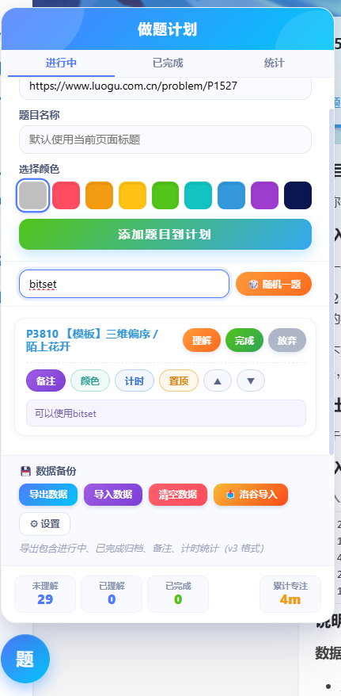
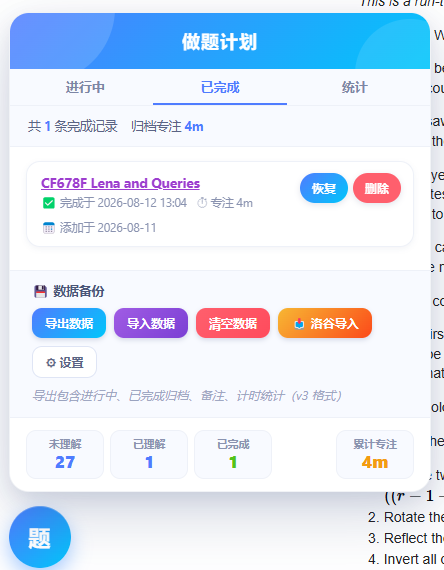
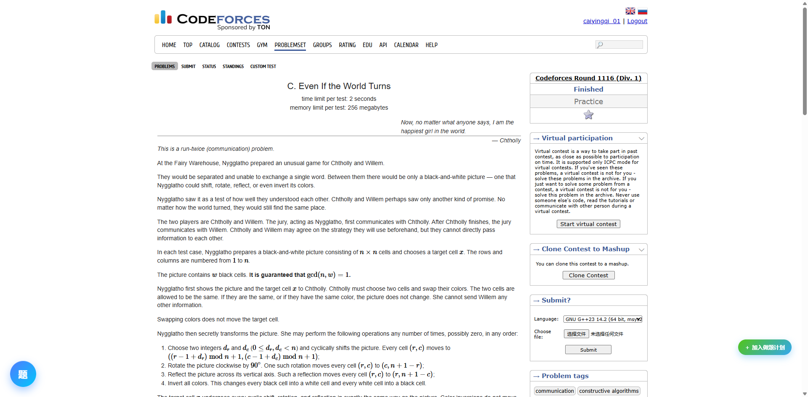
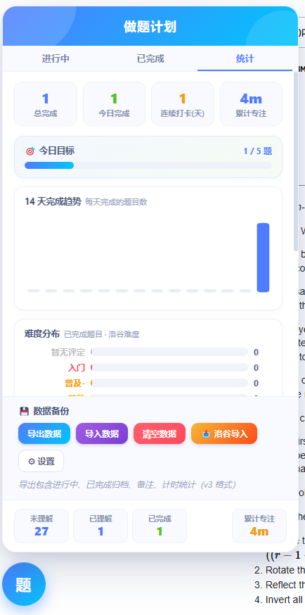
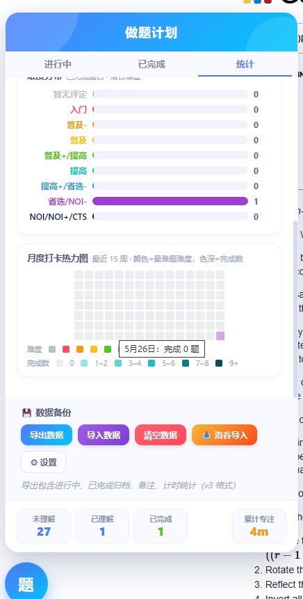

# 📚 做题计划管理器

[English](./README-en.md) | [简体中文](./README.md)

> 做题计划管理器 v3.11.0 —— 洛谷做题计划 better

一款面向 OI / ACM / 算法学习者的**跨站做题计划管理器**。全站注入，无论你在刷洛谷、Codeforces、AtCoder 还是 UVa，都能随时把题目收进自己的做题清单，专注、打卡、统计一条龙。

- 🦾 脚本管理端：**Tampermonkey** 等
- 🚀 在线安装：[GreasyFork](https://greasyfork.org/scripts/565773)
- 📄 许可证：MIT
- 感谢 Deepseek 在脚本开发以及 Readme 编写中提供的支持，保证 Deepseek 的贡献远大于 [Nuclear_Fish_cyq](https://www.luogu.com.cn/user/670355)。
- 感谢藤本树提供的精神支持。
- 本脚本参考的项目有：[luogu-api-doc](https://github.com/0f-0b/luogu-api-docs)、[extend-luogu](https://github.com/extend-luogu/extend-luogu)。

---

## ✨ 核心特性

### 🎯 计划管理

- 添加题目迅速准确
- 理解 / 完成 / 放弃，完成的题目自动归档
- 支持置顶分组、同组内排序
- 题目备注功能
- 题目名与备注的搜索功能，随机一题
- 跨平台支持

### ⏱ 番茄钟专注

- 专注 / 休息计时，支持自动休息
- 专注时长自动累计到对应题目

### 📝 备忘录

- 支持排序、置顶

### 📊 数据统计

- 总览卡片、14 天趋势、做题热力图、难度分布
- 每日目标设置 + 进度条

### 📥 洛谷、CF 深度集成

- 一键导入洛谷现有做题计划、洛谷题单
- 洛谷题单页批量导入（支持「题号 + 题名」格式）
- 自动获取洛谷、RMJ 题目难度
- 自动获取洛谷、CF 题目标签

### 🌐 多 OJ 支持

- 洛谷 / Codeforces / AtCoder / UVa 一键加入（SPOJ 暂不支持）
- 支持快捷手动加入题目

### 💾 数据安全

- 导出备份 / 合并导入（按 URL 去重）/ 一键清空
- 数据仅存本地（GM 存储）

---

## 🚀 快速上手

1. 安装脚本管理器：Tampermonkey 或 ScriptCat
2. 访问 [GreasyFork 页面](https://greasyfork.org/scripts/565773) 点击安装
3. 任意页面左下角点击悬浮按钮，开始管理你的做题计划！










## 🔧 开发 / 贡献

```bash
# 本仓库根目录的 .user.js 即完整源码，可直接安装
# 语法检查
node --check 做题计划管理器.user.js
```

- 提交代码后，GitHub Actions 会自动运行语法检查
- 欢迎提 Issue 反馈 Bug / 建议新功能
- 版本更新以 GreasyFork 线上版本为准

## ⚠️ 声明

- 请合理使用题单导入功能，作者 **不** 为滥用脚本的后果负责，请 **不** 要高频使用与洛谷 API 相关功能。**合理** 使用该插件一般不会对您的 OJ 账号带来影响。

## 📜 更新日志

### v3.11.x

- v3.11.0：大更新。添加了暗色模式，英文 i18n，备忘录功能。一键加入题目可以自动获取标签作为备注，题单一键导入可以筛选难度区间。

### v3.7.x

- v3.7.2：小更新（黑色难度色调整为 #0A164F，随机按钮尺寸微调）
- v3.7.0：大更新。新增题目及备注搜索、随机题目、难度分布、更新的热力图、难度修改、合并导入

### v3.1.x

- v3.1.4：修复若干 bug
- v3.1.2：新增题单界面；修复 bug、优化
- v3.1.1：支持导入洛谷做题计划与题单，洛谷 / AT / CF / UVa 一键加入

### v2.x

- v2.7.1：题目排序、完成归档、做题热力图
- v2.2.x：番茄钟计时、题目备注、UI 翻新

---

Made with ❤️ by [Nuclear_Fish_cyq](https://www.luogu.com.cn/user/670355)

本脚本的开发耗费了约 14 元的 token，欢迎来[捐钱](https://cdn.luogu.com.cn/upload/image_hosting/xzraqh5b.png)嘻嘻。
